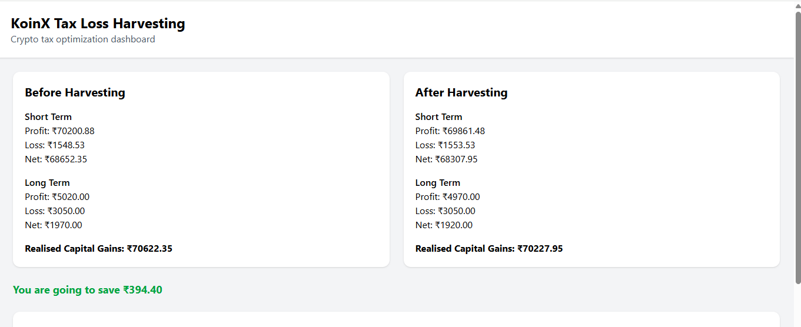
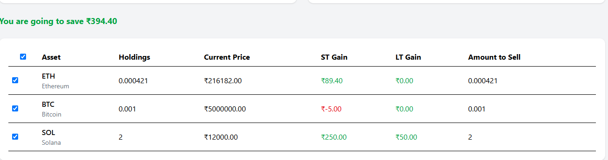

# KoinX Tax Loss Harvesting

A responsive **React + TypeScript** application that simulates a Crypto Tax Loss Harvesting dashboard. The application allows users to select holdings for tax loss harvesting and instantly view updated capital gains and estimated tax savings.

---

## Features

- Display capital gains before harvesting
- Display capital gains after harvesting
- Real-time tax calculations
- Select individual holdings
- Select All / Deselect All functionality
- Dynamic Amount to Sell calculation
- View All / Show Less holdings
- Mock API integration
- Responsive UI
- Loading state while fetching data

---

## Tech Stack

- React
- TypeScript
- Vite
- Tailwind CSS

---

## Project Structure

```text
koinx-tax-loss-harvesting/
│
├── public/
│
├── Screenshots/
│   ├── dashboard.png
│   └── holdings-table.png
│
├── src/
│   ├── api/
│   │   ├── capitalGainsApi.ts
│   │   └── holdingsApi.ts
│   │
│   ├── components/
│   │   ├── Header.tsx
│   │   ├── CapitalCard.tsx
│   │   └── HoldingsTable.tsx
│   │
│   ├── utils/
│   │   └── calculations.ts
│   │
│   ├── App.tsx
│   ├── main.tsx
│   └── index.css
│
├── package.json
├── tsconfig.json
├── vite.config.ts
└── README.md
```

---

## Installation

### Clone the repository

```bash
git clone https://github.com/kowshikadorraju03-lab/koinx-tax-loss-harvesting.git
```

### Navigate to the project

```bash
cd koinx-tax-loss-harvesting
```

### Install dependencies

```bash
npm install
```

### Run the development server

```bash
npm run dev
```

---

## Mock APIs

### Holdings API

Returns:

- Coin name
- Current price
- Average buy price
- Quantity held
- Short-term gain/loss
- Long-term gain/loss

### Capital Gains API

Returns:

- Short-term profits
- Short-term losses
- Long-term profits
- Long-term losses

---

## Functionality

### Before Harvesting

Displays:

- Short-Term Profit
- Short-Term Loss
- Net Short-Term Gain
- Long-Term Profit
- Long-Term Loss
- Net Long-Term Gain
- Total Realised Capital Gains

### After Harvesting

Automatically updates whenever holdings are selected.

- Positive gains reduce profits.
- Negative gains increase losses.
- Estimated tax savings are calculated automatically.

---

## Assumptions

- Holdings are fetched from mocked APIs.
- Selecting a holding harvests the complete holding.
- Amount to Sell equals the selected holding quantity.
- Capital gains update instantly after selection.

---

## Screenshots

### Dashboard



### Holdings Table




---

## Future Improvements

- Search holdings
- Filter holdings
- Sorting options
- Better UI matching the Figma design
- Charts for tax analysis
- Dark mode support
- Export tax reports

---

## Deployment

The application can be deployed on:

- Vercel
- Netlify

---

## Author

**Kowshika Dorraju**

- GitHub: https://github.com/kowshikadorraju03-lab

---

## License

This project is developed for the **KoinX Frontend Internship Assignment**.
